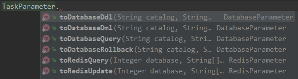
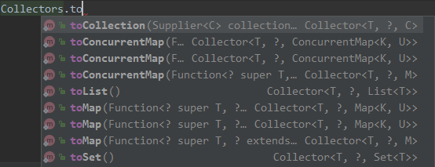

# 静态方法构造
http://gitlab.nxin.com/liuyangc3/rid/commit/383e873e4c57f0b992126e48f573f4f396d40209

before
```java
public class AbstractSqlTaskParameter {
    protected String catalog;
    protected String[] script;
    protected boolean transaction;
    protected boolean rollback;
}

// 实现1
public class DatabaseQueryTaskParameter extends AbstractSqlTaskParameter {
    public DatabaseQueryTaskParameter(String catalog, String[] script) {
        super(catalog, script, ExecuteMode.QUERY, false, false);
    }
}

// 实现2
public class DatabaseTestDmlTaskParameter extends AbstractSqlTaskParameter {
    public DatabaseTestDmlTaskParameter(String catalog, String[] script) {
        super(catalog, script, ExecuteMode.UPDATE, true, true);
    }
}

// 实现 3
public class DatabaseExecuteDdlTaskParameter extends AbstractSqlTaskParameter {
    public DatabaseExecuteDdlTaskParameter(String catalog, String[] script) {
        super(catalog, script, ExecuteMode.UPDATE, false, false);
    }
}

// 实现4
public class DatabaseTestDmlTaskParameter extends AbstractSqlTaskParameter {
    public DatabaseTestDmlTaskParameter(String catalog, String[] script) {
        super(catalog, script, ExecuteMode.UPDATE, true, true);
    }
}

tree -L 1  parameter
├── AbstractSqlTaskParameter.java
├── DatabaseExecuteDdlTaskParameter.java
├── DatabaseExecuteDmlTaskParameter.java
├── DatabaseQueryTaskParameter.java
└── DatabaseTestDmlTaskParameter.java
```

after
```java
/**
 * TaskParameter 描述了一个用户请求的任务
 */
public final class TaskParameter {

    private TaskParameter() { }

    @Data
    @AllArgsConstructor
    public static class DatabaseParameter {
        private String catalog;
        private String[] statements;
        private ExecuteMode mode;
        private boolean transaction;
        private boolean rollback;
    }

    @Data
    @AllArgsConstructor
    public static class RedisParameter {
        private Integer database;
        private String[] statements;
        private ExecuteMode mode;
    }

    public static DatabaseParameter toDatabaseQuery(String catalog, String[] statements) {
        return new DatabaseParameter(catalog, statements, ExecuteMode.QUERY, false, false);
    }

    public static DatabaseParameter toDatabaseDml(String catalog, String[] statements) {
        return new DatabaseParameter(catalog, statements, ExecuteMode.UPDATE, true, false);
    }

    public static DatabaseParameter toDatabaseDdl(String catalog, String[] statements) {
        return new DatabaseParameter(catalog, statements, ExecuteMode.UPDATE, false, false);
    }

    public static DatabaseParameter toDatabaseRollback(String catalog, String[] statements) {
        return new DatabaseParameter(catalog, statements, ExecuteMode.UPDATE, true, true);
    }

    public static RedisParameter toRedisQuery(Integer database, String[] statements) {
        return new RedisParameter(database, statements, ExecuteMode.QUERY);
    }

    public static RedisParameter toRedisUpdate(Integer database, String[] statements) {
        return new RedisParameter(database, statements, ExecuteMode.UPDATE);
    }
}
```

可以看到通过IDE可以提示



同样的用法在 java.util.stream.Collectors 包



优势

- 减少文件数量
- 相比 constructor, 可以通过合理命名表达
