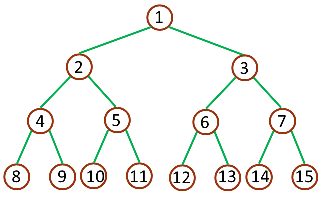
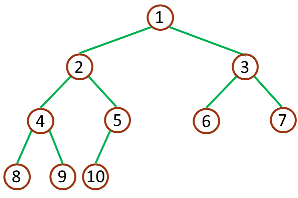

binary tree
------
性质

二叉树的每个结点至多只有二棵子树

二叉树的子树有左右之分

满二叉树：一棵深度为 k，且有 2k - 1 个节点称之为满二叉树

完全二叉树：深度为 k，有 n 个节点的二叉树，当且仅当其每一个节点都与深度为 k 的满二叉树中序号为 1 至 n 的节点对应时，称之为完全二叉树

用人话说就是，除第 k 层(最底层)外，其它各层的结点数都达到最大个数，第 k 层所有的结点都连续集中在最左边，这就是完全二叉树。

遍历二叉树
-------

Preorder Traversal 前序遍历：根节点->左子树->右子树

Inorder Traversal 中序遍历：左子树->根节点->右子树（仅支持二叉树）

Postorder Traversal 后序遍历：左子树->右子树->根节点