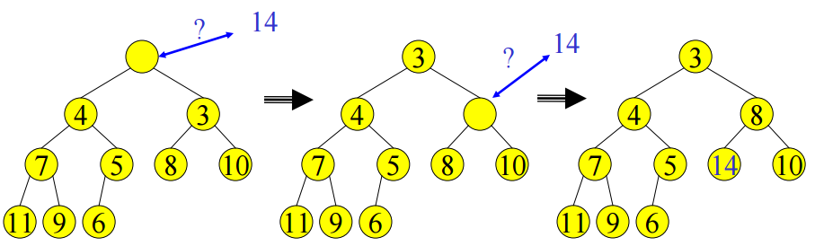

完全二叉树 堆
---------

二叉堆简称堆，英文名 heap。

堆是一个满足一些排序特性的完全二叉树。

根据排序特性的不同，可以分为2种堆：

* 最小堆 每个节点都小于等于父节点，根节点是整个堆的最小值
* 最大堆 每个节点都大于等于父节点，根节点是整个堆的最大值

堆结构
----
由于堆的紧密性，最底层以外每层都是满的，最底层节点从左紧密排列

堆可以用数组去表示，如图

从图中可以很容易的得出这样的结论

若父节点的index 为 i
* 左子节点的index 为 2i
* 右子节点的index 为 2i+1

插入，插入的元素必须是数组的最后一个元素 A[n]
删除，删除的元素必须是数组的第一个元素 A[0]

堆操作
---
插入

为了满足完全二叉树的性质，插入的元素必须是最后一层从左向右的开始的，最后一个节点。
即数组的最后一个元素。

插入元素后，堆不满足排序特性，需要调整元素2的位置

我们可以看到插入的元素父节点，和父父节点 父父父节点.... 一直到根节点是有序的。

这是因为堆的排序特性，每个节点都小于等于父节点。

这样我们只需要将插入的元素2和每个父节点进行比较即可。又因为父节点们是有序的，
这个问题就变成了一个插入排序的问题。

删除

为了保持完全二叉树的性质，一般从根顶删除元素。然后将最后一个元素放到根顶。

然后调整堆的排序特性

堆排序
---

从上面的说明可以看出，堆排序第一步是让数组堆化，把数组变成一个最大堆或者最小堆。

如果转化成最小堆，那么堆顶元素就是堆的最小值，我们只需每次取出堆顶，进行删除堆顶元素的操作即可。

优先队列
----
优先队列不同于普通的先进先出队列。它是根据优先级进行元素的出列。

它非常适合基于优先级的一些应用场景。

本周的作业是使用堆结构实现一个优先队列 PriorityQueue。

队列有2个方法 push(Object) 和 pop(Object), 每个Object 要有一个priority的属性。

自定最大优先级还是最小优先级出列

[参考文献](https://courses.cs.washington.edu/courses/cse373/06sp/handouts/lecture10.pdf)
