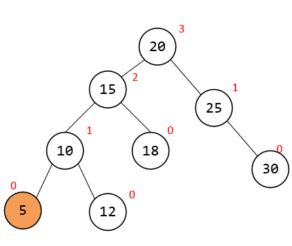
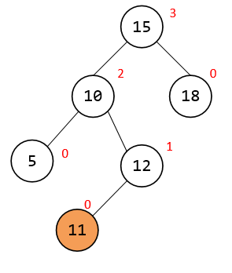
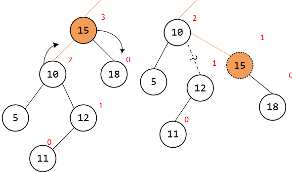

二叉搜索树
-----
Binary Search Tree BST

性质

* 左子树的所有节点小于当前节点。
* 右子树的所有节点大于当前节点。


这个定义非常简单，一句话就是左孩子比父节点小，右孩子比父节点大。

还有一个特性就是”中序遍历“可以得到有序的结果。
 
插入节点
----

```
[20, 15, 25, 18, 10, 12, 30]
```

首先插入20，此时树只有一个节点，下图最左边

接着插入15， 15小于20，放在20左节点，下图中间

接着插入25， 25 大于20，放在右边， 下图右边


然后继续插入 18， 18小于20，走左边，左边已经有15了，18 比 15大，所以18 放在 15右边


接着插入10，10小于20，走左边，10小于15，放在15左边


后面就不继续了，总之很简单，最终得到BST树


通过观察BST可以发现，最小值在最左边，最大值在最右边

排序就是中序遍历

删除元素
---
假设我们要删除元素15，下面列出排序数组中15的位置


因为中序遍历数组是有序的，我们仅需将前一个节点或者后一个节点移动到删除节点的位置上即可。

体现在图中就是这样


无论移动哪个节点，最终的树都满足BST的性质，大家根据喜好选择


BST最大的问题就是，如果插入顺序有序，就变成了线型查找树。


在节点左右分布均匀的情况下，查找的效率是O(logN)，而线型情况下是O(N)


所以二叉查找树不是严格的O(logN)。


AVL树
----
平衡二叉树，AVL树是根据它的发明者G. M. **A**delson-**V**elskii和E. M. **L**andis命名的。

它是一种特殊的二叉搜索树。主要解决上面提到的BST不够"平衡"的问题。使得查找的时间尽量接近O(logN)。

介绍性质前，需要先介绍一个概念：节点高度

所谓节点的高度就是， 当前节点到子叶节点的最长路径的长度，为了更好的理解这个概念，这里我对节点进行高度的标记。

首先一个子叶节点自己到自己的路径没有经过任何节点，所以高度为0

那么只有1个子叶节点的根节点的高度显然为1


下图一个BST树的各个节点的高度


假如我们用h(n)表示节点n的高度，那么通过观察上图，不难发现一个节点的高度应该是:左/右子树的根节点的高度的最大值再加1,即
```
h(n) = max(h(n.left), h(n.right)) + 1
```

AVL除了满足所有BST性质外，还要满足一个性质，这个性质和节点高度有关

性质：任一节点的左子树节点高度和右子树节点高度相差不超过1。

```
|h(n.left) - h(n.right)| <= 1 
```


所以当一个AVL树高度h时 左右子树要么高度都是h-1,要么一个是h-1，一个是h-2

如果一个节点的左右子树节点高度的差值大于1，我们就认为这个节点失衡了。

插入
---
既然AVL树是BST树，那么插入时必然要满足BST插入的性质,所以插入方法和BST相同

例如插入5，发现插入完成后，刚好满足AVL性质，无需其他操作



也有可能插入完成后节点高度产生了变化，新树有可能会不满足AVL的性质，例如插入11,(蓝色高度为插入前节点高度，红色为节点当前高度)


注意图中画圈的两个节点，沿着插入节点向上走，可以最先发现节点15失衡了。

那么如何调整这个树，使它保持AVL的性质？请看下文

旋转 rotation
-----------
恩，这个词很贴切，我们知道一个人转多了会晕，树也是如此，转多了人也会晕。

官方的做法是进行左旋和右旋，但是说实话这个不太好理解，我也不明白为什么。

所以今天我想了一下这个问题，这里我就讲一下我自己的理解，不一定正确，大家先看看说的有没有道理。

首先我们单独拿出这个失衡的树，如图



因为左右子树高度差值大于1了，那么最直接的办法就是去调整子树的高度，使得差值小于等于1。


既然是调整子树高度，使得差值小于等于1，要么调整左边L，要么调整右边R。

那么显然图中左边节点高度较大，我们应该调整左边。

那么就应该是 左边让的高度减少1，其实我们只需把左子树的根(10),变成整个树的根动一个节点，改变2个指针，就可以达到这个目标



但是移动完成后不满足BST的性质，大小顺序乱了。为了解决这个问题，我们把这个树再简化一下。

用三角形表示无关的子树，那么这棵树可以简化成这样，我们先用抽象图来看旋转问题。原图后面再讲。


根据中序遍历的结果，可以很容易得出这个数的排序为
```
A 10 B 15 C

A < 10 < B < 15 < C
```

而我们希望 10 和 15 交换后， 左边高度 减1， 然后整个树仍然是有序的。这样就既满足AVL性质有满足BST性质了。

这里我们先把 15 变成 10 的右子节点


因为A < 10, 所以10的左边是A， C > 15, 15的右边是C，得到


最后剩下B， 10 < B < 15 ,所以 B 应该放在10的右边，15的左边


这时候 根据中序遍历，得到这个树的排序是
```
A 10 B 15 C
```
跟转化前的顺序一模一样有没有！，这样我们既减少了左边的高度，又没有丢失BST的性质。

那么变化前后的样子就是这样


旋转的规则就是，把重的一边(节点高度大的子树) 的根节点 放到失衡节点的位置，失衡节点变成子节点。

重的一边在左边，失衡节点向右走，叫右旋


是不是很形象！

那么左旋也就出来了


判断左旋还是右旋，就是计算哪边节点高度小，右边小就右旋，左边小就左旋。

是不是很简单！！

单旋还是多旋
------

当然问题到这里还没有完，我们看看来这样的一个情况：

在插入4后，可以找到失衡节点是5。


5 左重右轻，要对 5 进行右旋，得到
 


你没看错，旋转完成后依然不满足AVL树性质。

还有上回没讲的完的图，右旋15后


为什么？

先观察两个图，发现失衡节点的失重方向，  还有失重方向子树的  失重方向是相反的。

换句话说 失衡节点 高度大的子树记为S， S在失衡节点的哪边，记为 D1

S 的子树的 失衡方向记为D2， 这两图都是 D1 和 D2 相反的。

这种情况下，对失衡节点进行旋转，是无法得到AVL性质的。

很容易证明，请看下图，我们把开始的左旋的图，引入一个Z节点，使得X到Z 失衡的方向 和 Z的子树间失衡方向相反
 
 


对X进行左旋后，并什么卵用。

正确的做法是 选右旋 Z ，是的X和子树的失衡方向一致了，再左旋X


最后的完结
-----

回到最初的问题上来，应该如何调整这个树


15 失衡 左边， 节点10 失衡 右边，先要对10进行左旋，在对15进行右旋


终于平衡了。

删除
---

删除同 BST 删除相同， 从中序遍历中找出 被删节点的下一个节点，这个节点放在被删节点即可。

删除完成后，可能会影响树的平衡，需要回溯每个父节点，计算子树的是否平衡，根据情况进行旋转调整。

进行单旋还是双旋 判断方式和插入相似

本周请杨明哲，李玉福老师 完成AVL插入的操作。 不完成要发红包，金额20元。


如果你觉得写得还不错，点下start 支持一下

如果你还有问题，欢迎提交iusse。 

have fun！

------
推荐视频

https://www.coursera.org/learn/gaoji-shuju-jiegou/lecture/PJ9Jy/avlshu-de-gai-nian-yu-cha-ru-cao-zuo

https://www.coursera.org/learn/gaoji-shuju-jiegou/lecture/dt0sr/avlshu-de-shan-chu-cao-zuo-he-xing-neng-fen-xi
