前言
-------
BST 在最差的情况下效率比较低，会接近O(n)，为了在最差的情况下也能达到lgN的效率，
前面介绍了AVL。

虽然只需要lgN次比较操作就可以找到想要的值。不但是，每次插入元素之后维持树的平衡状态太昂贵和复杂，
所以需要一种新的数据结构来保证在最坏的情况下插入和查找效率都能保证在对数的时间复杂度内完成。

下面先介绍2-3查找树

2-3 tree
-------
和二叉树不一样，2-3树运行每个节点最多保存两个的值。

2-3树有两种节点，2节点(2-node)和3节点(3-node)

* 2节点,有一个值，2个儿子，左边儿子小于父亲，右边儿子大于父亲
* 3节点,有2个值，3个儿子，左边小于父亲的小值，右边大于父亲的右值，中间介于2值之间

如图：

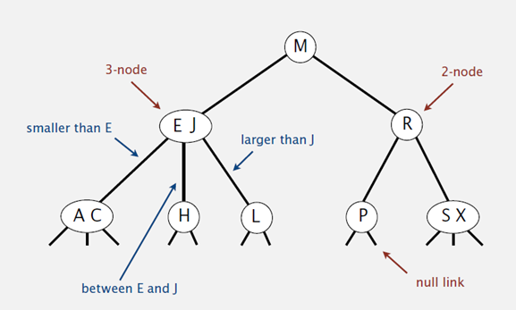

查找

在进行2-3树的平衡之前，我们先假设已经处于平衡状态，我们先看它的查找操作。

2-3树的查找操作和二叉查找树类似，要确定一个节点是否在2-3树内，只需递归地进行和根节点比较即可，如图

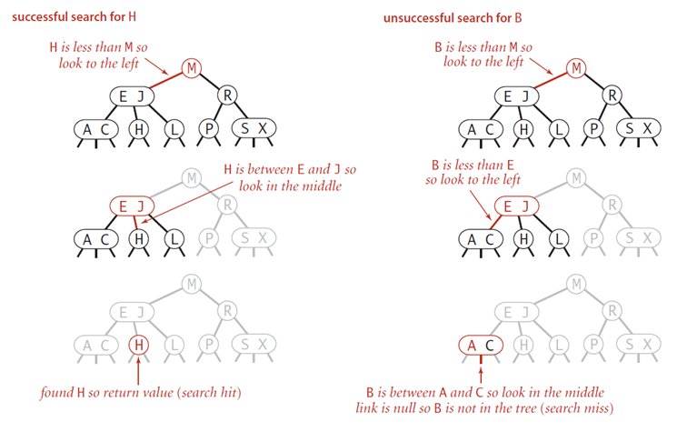

插入
---
如果被插入的节点是一个2-node节点，我们只需要将新的元素放到这个2-node节点下面，使其变成一个3-node节点即可


如果被插入节点是一个3-node节点，则需要分情况

* 没有父节点

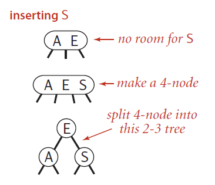

先暂时变为一个4节点(4-node)，里面有3个值，然后按照左中右的循序把4-node节点变成一个2-node节点的2-3树

* 父节点是2节点

和第一种情况一样，我们也是将新的元素插入到3-node节点中，使其成为一个临时的4-node节点。

然后将该节点中的`中间元素`提升到父节点即2-node节点中，使其父节点成为一个3-node节点。

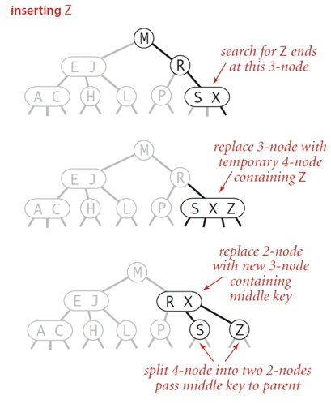

* 父节点是3节点

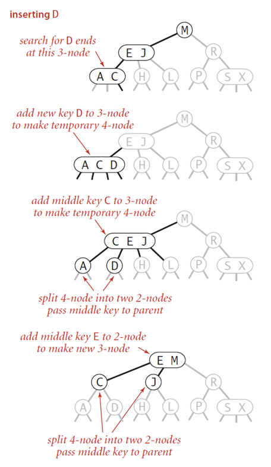

第一步也是先变成临时的4-node节点。

然后中间元素提升至父节点，但是父节点变成了4-node节点，将父节点的中间元素提升至其父父节点。

如此反复，直至遇到一个是2-node节点父节点，将其变成3节点即可。

* 当根节点的分裂

在插入节点到根节点的路径上，所有的节点都是3-node节点，那么插入完成后，根节点会变成一个4-node节点。

这时候需要将根节点分裂成2节点的树，真个树的高度同时+1。


red-black tree
-----------
红黑树应用很广泛

内核epoll定时器

Java中的java.util.TreeMap,java.util.TreeSet


2-3树的插入算法过于复杂，有没有一种简单方法来表示3节点？

对3节点编码
-------
有一种叫做红黑二叉搜索树(red-black BSTs)的树结构。其最核心的思想是，
用标准的二叉树附加一些额外的信息来表示2-3树。这样我们就可以使用2节点来表示3节点。

我们把节点的连接分成两种类型：红色连接和黑色连接

* 如果连接的颜色是红色，我们可以把父节点和子节点，假装看做成一个3-node节点。
* 如果连接的颜色是黑色，还是普通的二叉树连接。

红色连接放左边。

我们先看一下如何用这种方式来表示文章开头的2-3树:

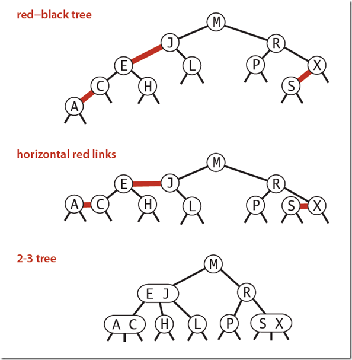

可以看到这其实是2-3树的另外一种表现形式，如果我们将红色的连线变成水平的，
那么红色连接的两个2-node节点就可以表示成2-3树中的一个3-node节点了。

我们可以把连接颜色的信息存放入节点中，例如在节点中加入一个布尔值，
true代表这个节点到其父节点的连接是红色，
而false代表当前节点到父节点的连接是黑色。

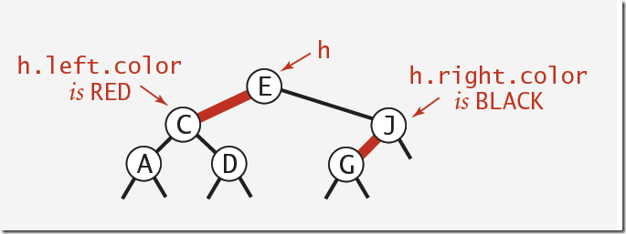

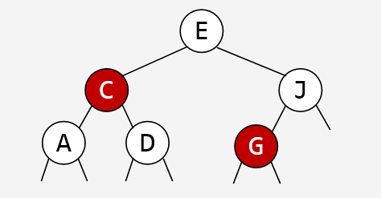

现在，连接的颜色就变成了节点的颜色，这可以看作成节点的染色方法

这种带有颜色编码的好处是，可以直接按照BST的查找方式进行查找操作，又保存了额外的信息。

红黑树
------
其实上面的颜色编码就是红黑树。

一颗红黑树首先是BST，其次节点中有一个额外布尔值表示节点的颜色，true 表示红，false 表示黑。

红黑树的性质:

* 节点颜色非红即黑
* 根和叶节点（叶节点即指树尾端NIL指针或NULL节点）是黑色
* 红色节点的父亲是黑色节点
* 如果一个节点是红的，那么它的两个儿子都是黑的
* 对于任一节点而言，其到叶节点树尾端NIL指针的每一条路径都包含相同数目的黑节点。

下面详细解释一下这个性质的由来

> 节点颜色非红即黑

这个很好理解，节点的布尔值要么是true 要么是false


后面的性质不太好理解，为了更好地解释这些性质，我们看一个例子，用一颗红黑树来表示完全2-3树：

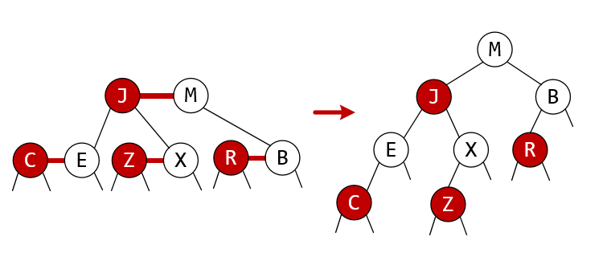

> 红色节点的父亲是黑色节点

首先3节点中的较小值是`A`，较大值是`C`，然后我们把A 和 L M 组合在一起，C 和R组合在一起，
定义为A 和 C之间的连接是红色的。

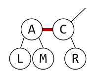

根据染色方法，节点布尔值为true，代表这个节点到其父节点的连接是红色，那么显然A到C是红色，A是true，即红色节点，
我们先把A染红

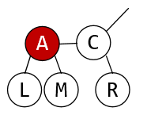

如果父节点C是红色，说明C是一个3节点较小值，C有右边应该还有一个值，例如D

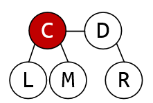

如果A 和 C 都是红色， 这就是一个4节点了

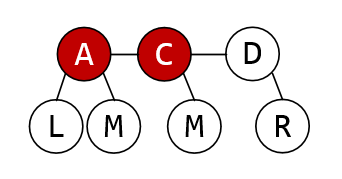

所以A为红色时，C不能是红色，所以 红色节点的父亲是黑色节点

> 如果一个节点是红的，那么它的两个儿子都是黑的

这是个逻辑运算题，已知红色节点的父亲是黑色节点，那么求红色节点的儿子的颜色。

用数学来表达就是：假设父节点A和左子节点L，右子节点R，已知如果L或者R为red，A必为black，若 A=red(true)时,求L和R的值。

当L和R之中只要有一个为red，A就是black，即
```
if (L==true || R==true) {
    A=false
}
```
所以 A=true 的条件就是 !(L==true || R==true),即 L==false && R==fasle，即L=red且R=red

> 根和叶节点（叶节点即指树尾端NIL指针或NULL节点）是黑色

成为红色节点的条件是，3节点里右边要有一个比他大的值，也就是说要有一个父亲。

根节点没有父亲，所以只能是黑色。

成为红色节点的条件是， 3节点里面，左边 和 中间子节点和作为当前节点的儿子。
 
叶节点没有儿子，所以只能是黑色。

> 对于任一节点而言，其到叶节点树尾端NIL指针的每一条路径都包含相同数目的黑节点。

这应该是一个保证树的平衡的约束性质。算是规定

插入
----
最简单的插入，根节点是黑色的情况

根节点b，将a插入到b的左边

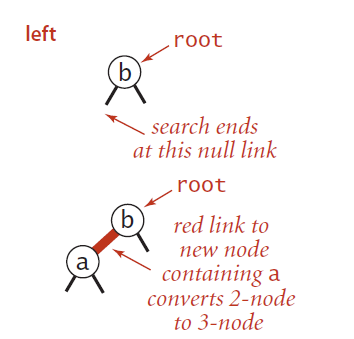

因为要使插入后高度最小，即保证看起来像2-3树，那么a节点必然是红色。

根节点a，将b插入到a的右边 (a的左边为黑)

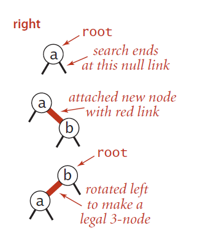

因为要使插入后高度最小，即保证看起来像2-3树，那么b节点必然是红色，但是这个红边在右边，所以对a左旋，
a变为红色，b变黑色。

同样还是插入到A的右边，对A左旋(A的左边为黑)

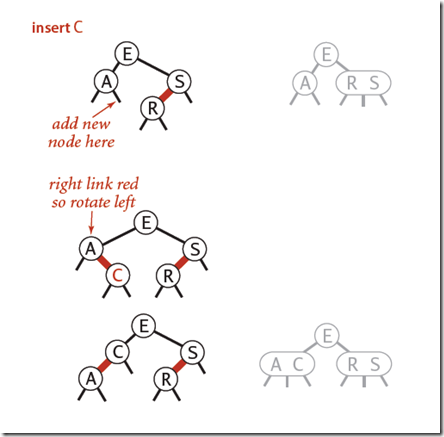

可以得出结论，插入的节点必然是红色，如果插入到左边，且根节点是黑色，不用旋转，插入到右边，左边为黑色的时，需要左旋。

颜色反转
------

根节点是黑色，左边为红色，插入到右边时

b是根节点，a是左节点，当我们插入c后，两边都是红色，而b是根节点，一共三个节点，直接用2节点表示即可。
所以 a 和 c 从红色变成黑色。

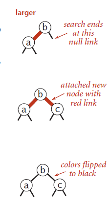


当插入的根节点是红色时
-----------


先看插入左边，左边连续2个红色节点， 性质要求红色节点的父节点是黑色，所以需要调整。

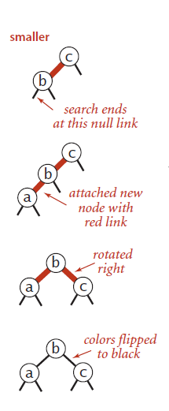

先对b进行右旋， 变成颜色反转的情况，直接进行颜色反转。


插入右边，因为红边不能在右边，所以先对a左旋，然后就变成上面的左边连续2个红色的情况了。处理方法一样

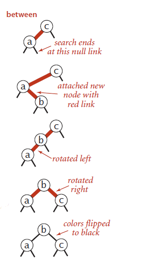

颜色反转之2
------
刚才的颜色反转 都是 根节点上面没有节点了，如果上面还有节点呢？

假设E是某次插入的节点，它可能是个左子节点，也可能是个右子节点，我们先不管它。
E左边是红色，当把S插入到E的右边时，会出现颜色反转的情况

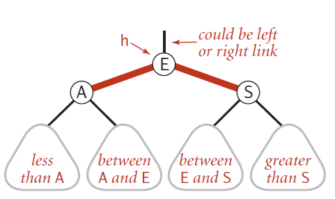

变成了一个4节点，仅仅把子节点A、S变成黑色是不够的。考虑到E上面还有父亲，

4节点要变成3节点，需要将中间的E节点上升到E的父节点里面去，所以E要变成红色。

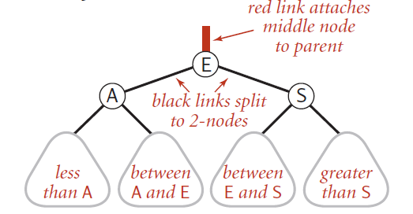


但是E变为红色还是不够的，上升完成后，还要看E的位置是在左，还是在右。还需要进一步的旋转。

例如下面这个情况，例如插入H后，通过一次右旋，H R S 构成了颜色反转的情况，当颜色反转后，R变成红色但是在右边。
由于不允许右边边红色，还需要对E左旋一次。

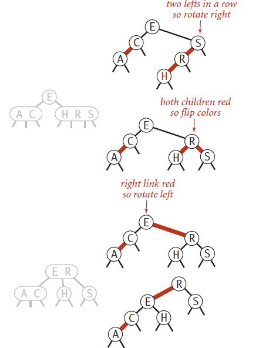

这就是颜色反转后，如果根节点上面还有父亲，还需要多一次判断。

我们把上面的几种情况，以及状态转换的方式都放在一张图上

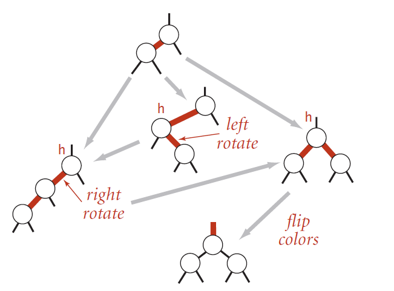

最后来一张复杂操作的示意图


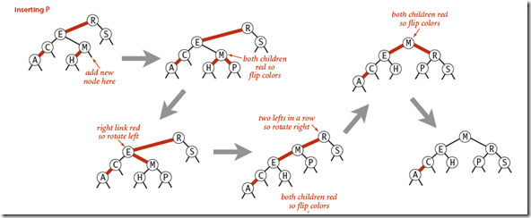

end
------
请杨明哲老师完成 2-3树的插入，提交pull-request

请赵勋老师完成红黑树的插入。

如果你觉得写的还不错点个start，如果有疑问提交issue，我会尽快回复。