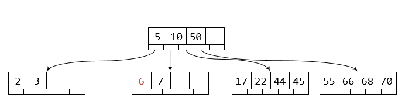

B Tree
---
1) 所有子叶节点在同一层 

2) 树的度 d 大小和磁盘block大小有关

3) 非root节点必须包含 d-1 个 key。 root 至少 1 个 key.

4) 所有节点(包括 root) 最多 2d – 2 个 keys.

5) 一个节点的子节点的个数是 key 的个数加 1.

6) 节点的 keys 升序排列。在 k1 和 k2 指向的子节点所包含的key的范围是大于等于 k1 且小于 k2.

下面是一个度为 3 的 B-Tree，一般情况下度要大于等于2.

插入
-----
插入方式和2-3tree类似，例如插入17

插入6，2-3-5-7这个节点满了，类似于2-3tree，将中间节点5提升到父节点

插入21，17-22-44-45节点满了，提升中间节点22到父节点

插入67，55-66-68-70节点满了， 提升67到父节点，但是父节点5-10-22-50也是满的，可以先把根节点临时变为5个key的节点，如同

再对5-10-22-50-67进行中间节点的提升，此时根节点应该是22

删除
----
回顾一下二叉搜索树的删除，如果被删节点有子树，根据中序遍历规则，我们可以从左子树取出最大值，或者从右子树取出最小值，
替换到当前结点即可。

同理，如果我们删除一个非子叶节点的key，那么从左子树，或者右子树取出相应的 key 替换当前 key 即可。
例如删除刚才的B-tree的键67，直接用66替换即可

如果删除子叶节点的key，一般分为2步：
* 因为是子叶节点，直接删除key即可
* 删除key会导致当前结点的key过少

因为一个节点至少要有 d-1 个 key，如果节点的key数量小于要求，我们称这个节点underflowed，低于水平线。

删除完key后如果节点不是underflowed，那么删除完成。

如果出现underflowed，那么需要修复这个问题，修复根节点的underflowed和非根节点的underflowed有所区别，我们要分别讨论。

非根节点underflowed
-------------
我们看下面的B-tree，删除key 6， 子节点只剩7

我们可以尝试从别的节点"借" 一些 key，来解决underflowed状态。我们可以把当前节点和邻居节点"组合"在一起,
当然还要把中间值父节点的key 也加进来。

例如把[7] 和邻居 [17 22 44 45]，还有父节点的 key 10，组合成 [7 `10` 17 22 44 45]，
我们把组合的节点分割为3部分：
* 左 [ 7 10 ] 红
* 中 17 绿
* 右 [ 22 44 45 ] 蓝

然后把中间的key 放入父节点

当然也可以和左边进行组合

根节点underflowed
----
根节点至少有一个key，如果根节点是子叶节点(没有子树)，此时根节点underflowed，那肯定是这个key被删除了。整个树为空。

如果根节点不是子叶节点，那么根节点肯定至少有2个子树，如果root的key被删除，类似费根节点的key 删除，从子树找出一个key，替换删除key 即可。

那么什么情况下 跟节点会underflowed呢？当根节点只有1个key，且子节点发生underflowed时，如删除7

经过组合，根节点为空了，发生了underflowed，这时将新的子节点变为跟节点即可。

资料
------
https://webdocs.cs.ualberta.ca/~holte/T26/top.realTop.html

http://blog.codinglabs.org/articles/theory-of-mysql-index.html
